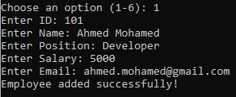

# Employee Management System (Python, CSV)

A simple **Command-Line Employee Management System** built in Python that stores employee records in a CSV file.  
It allows you to **Add, View, Search, Update, and Delete** employees with field validation.

## Features
- **Add Employee**: Input and validate ID, Name, Position, Salary, and Email.
- **View All Employees**: Display all employees from `employees.csv`.
- **Search Employee**: Find an employee by ID.
- **Update Employee**: Modify existing employee details (with validation).
- **Delete Employee**: Remove employee by ID.
- **Data Storage**: Uses CSV file (`employees.csv`) for persistent storage.

## Requirements
- **Python 3.8+** (tested on Python 3.13.6)
- No external dependencies (only Python’s built-in modules)

## Installation
1. Clone the repository:
git clone https://github.com/mfawzy6/EmployeeManagementSystem.git

2. Navigate to the project folder:
cd employee-management-system

3. Ensure employees.csv exists
The program will create it automatically on the first run if it does not exist.

## Running the Program (Windows Command Prompt as Administrator)
1. Open Command Prompt as Administrator

    *Press Start
    *Type cmd
    *Right-click Command Prompt → Run as administrator

2. Navigate to your project folder
cd C:\path\to\EmployeeManagementSystem

3. Run the program
python EmployeeManagementSystemProject.py

4. Follow the menu options:

**For example:**
----------------

**Notes**
- CSV file is stored in the same directory as the script.
- Employee ID must be unique and numeric.
- Salary must be a positive number.
- Name must only contain letters and spaces.
- Email must be in a valid format (example@domain.com).

